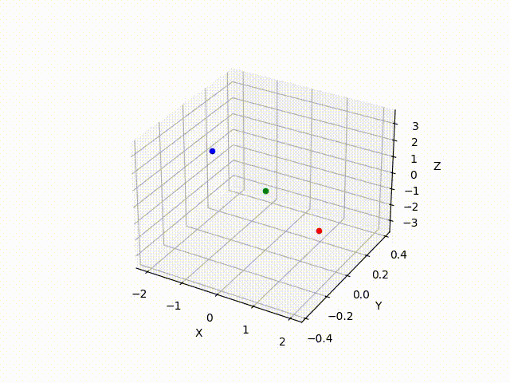

### A Random Number Generator Based on Chua Circuit
*The winning report of a [67th MIPT All-Russian Scientific Conference](https://conf.mipt.ru/)*



# Starring:
- https://github.com/OlegOpyakin - Oleg Opyakin
- https://github.com/vka228 - Daniil Vikultsev

## Overview
This project implements a hardware-inspired random number generator based on the chaotic behavior of Chua's circuit. There is a numerical solution of the system describing Chua circuit and algorythms for processing data from an experimental setup. 

## Key Components

### `main.py` - Core Simulation
- Implements the Chua circuit equations:
- Uses Euler method for numerical integration
- Tracks system state (x,y,z) over time
- Outputs trajectory data to CSV
- Visualizes the "double scroll" attractor
- Marks equilibrium points E₁, E₂, E₃

### `proc.py` - Sequence Processing
Processes data from an actual experimental setup.
- Converts chaotic trajectory to binary sequence:
  - 1 when x > 0 (right state)
  - 0 when x ≤ 0 (left state)
- Implements statistical analysis:
  - Random walk visualization
  - Iterated logarithm comparison
  - Binary sequence processing
- Generates output files for further testing


## Implementation Details
In the numerical solutions such parameters are used:
```python
dt = 0.01          # Time step
num_steps = 2000   # Simulation length
α = 15.6           # Chua parameter 1
β = 24             # Chua parameter 2
m₀ = -1.143        # Nonlinearity param 1
m₁ = -0.714        # Nonlinearity param 2
```
## Much more information may be found in 'chua_conference.pdf' and 'chua_math_basis_final.pdf'
